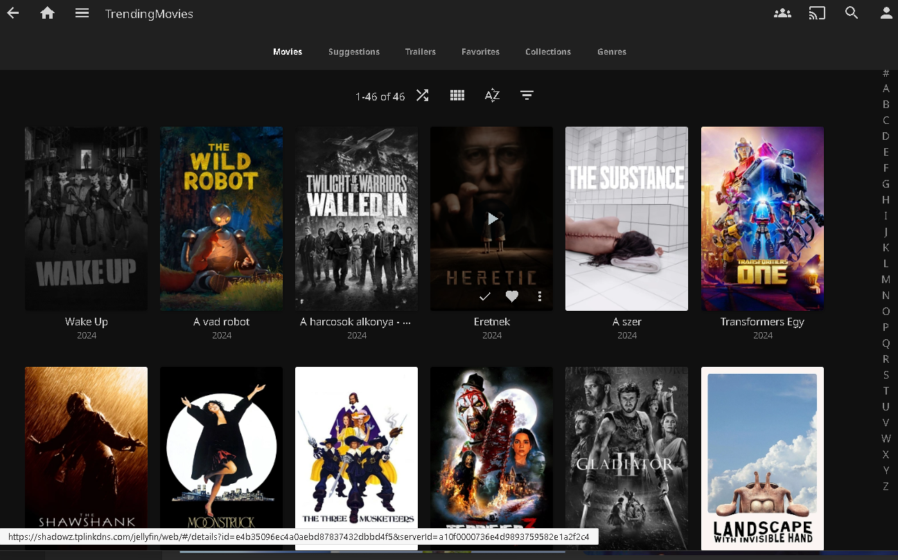

# CineFlow

[](https://github.com/szilab/CineFlow/actions/workflows/ci_cd.yaml)
[](https://www.python.org/downloads/)
[](https://opensource.org/licenses/MIT)

CineFlow is an open-source media automation system for discovering, managing, and organizing your movie collection. Inspired by [Overseerr](https://overseerr.dev) and [Jellyseerr](https://docs.jellyseerr.dev), CineFlow provides a streamlined approach to media management with support for multiple third-party integrations.

## Features

### Current Capabilities
- **Automated Media Discovery**: Collect trending and popular movies
- **Search Integration**: Find downloadable content through Jackett
- **Media Server Integration**: Sync with Jellyfin libraries
- **Download Management**: Automatic downloading via Transmission
- **Smart Library Management**: Create and maintain dummy libraries for preview
- **Visual Enhancements**: Custom poster modifications with status indicators
- **Flexible Configuration**: YAML configuration support

### Supported Integrations
- **[TMDb](https://www.themoviedb.org)** - Movie database and metadata
- **[Jackett](https://github.com/Jackett/Jackett)** - Torrent indexer aggregation
- **[Jellyfin](https://jellyfin.org)** - Media server integration
- **[Transmission](https://transmissionbt.com)** - Download client

## How It Works

1. **Discovery**: Periodically collects trending media from TMDb
2. **Indexing**: Searches for available downloads through Jackett
3. **Library Management**: Creates dummy entries in your media library
4. **Visual Indicators**: Modifies posters to show availability status:
   - Grayscale for unavailable content
   - Colored borders for specific qualities (HDR, resolution, etc.)
5. **Automation**: Downloads favorited items and removes completed downloads from dummy library



## Prerequisites

- Python >= 3.10 or Docker
- TMDb API key ([Request here](https://www.themoviedb.org/settings/api))
- Jackett instance with configured trackers
- Jellyfin media server
- Transmission download client

## Installation

### Option 1: Docker (Recommended)

```bash
# Pull and run the latest version
docker run -d \
  --name cineflow \
  --restart unless-stopped \
  -v /path/to/your/library:/library \
  -v /path/to/your/config:/config \
  sandorszilagyi/cineflow:latest
```

### Option 2: From GitHub Releases

Download the latest wheel file from [Releases](https://github.com/szilab/CineFlow/releases):

```bash
pip install cineflow-*.whl
export CFG_DIRECTORY="/path/to/your/config"
export EXPORT_DIRECTORY="/path/to/your/library"
cineflow
```

## Configuration

CineFlow uses a dual configuration system:
1. **Global Configuration** (`config.yaml`) - System-wide settings for modules
2. **Flow Configuration** (`.yaml` files) - Workflow definitions and automation logic

### Global Configuration (config.yaml)

Create `config.yaml` in your configuration directory with system-wide settings:

#### Required Settings
```yaml
tmdb:
  token:       # Your TMDb API key
  lang:        # Language code (default: "en-US")     -OPTIONAL-

jackett:
  url:         # Jackett instance URL
  token:       # Jackett API key
  include:     # Filter results by keywords           -OPTIONAL-
  categories:  # Torrent categories (default: "2000") -OPTIONAL-

jellyfin:
  url:         # Jellyfin server URL
  token:       # Jellyfin API key

transmission:
  url:         # Transmission web UI URL
  user:        # Authentication for Transmission     -OPTIONAL-
  password:   # Authentication for Transmission     -OPTIONAL-

library:
  rules:
  - expression: missing
    modification: grayscale
    property: link
  - expression: exists
    modification: border
    property: link
  - case_sensitive: false
    expression: contains
    modification: triangle
    property: torrent
    value: HDR
```

### Environment Variables

- `CFG_DIRECTORY`: Configuration directory path
- `EXPORT_DIRECTORY`: Library export path
- `LOG_LEVEL`: Logging level (DEBUG, INFO, WARNING, ERROR)
- `LOG_COLORS`: Enable colored logs (true/false)

Any setting from `config.yaml` can be overridden via environment variables using the format `MODULENAME_SETTING` (e.g., `TMDB_TOKEN`, `JELLYFIN_URL`) handy for simple setups with Docker.

### Flow Configuration

CineFlow's automation is driven by **flow files** - YAML configurations that define step-by-step workflows. The system automatically discovers and runs any `.yaml` files in your configuration directory (except `config.yaml`).

CineFlow includes ready-to-use flow files in `docker/examples` directory these files automatically copied to an empty config folder when run via Docker.

### Advanced Configuration and Custom Flows

Please see [Configuration Guide](docs/CONFIGURATION.md) for details.

## Usage

### Command Line Interface

```bash
# Start CineFlow
cineflow

# With custom config location
CFG_DIRECTORY=/path/to/config cineflow

# With debug logging
LOG_LEVEL=DEBUG cineflow
```

### Docker Usage

```bash
# Using docker-compose
services:
  cineflow:
    image: sandorszilagyi/cineflow:latest
    container_name: cineflow
    restart: unless-stopped
    volumes:
      - /path/to/library:/data
      - /path/to/config:/config
    environment:
      - CFG_DIRECTORY=/config
      - EXPORT_DIRECTORY=/data
      - LOG_LEVEL=INFO
      - TMDB_TOKEN=d56d...
```

## Project Structure

```
cineflow/
├── bases/           # Base classes and utilities
├── modules/         # Third-party integrations
│   ├── jackett.py   # Jackett integration
│   ├── jellyfin.py  # Jellyfin integration
│   ├── tmdb.py      # TMDb integration
│   └── transmission.py # Transmission integration
├── system/          # Core system components
│   ├── config.py    # Configuration management
│   ├── database.py  # Database operations
│   ├── logger.py    # Logging system
│   └── misc.py      # Utility functions
└── main.py          # Application entry point
```

## Contributing

We welcome contributions! Please see our [Contributing Guide](docs/CONTRIBUTING.md) for details on how to get started.

## Roadmap

- [ ] TV Series support
- [ ] Web UI interface
- [ ] Additional downloader support (qBittorrent, etc.)
- [ ] Additional media server support (Plex)
- [ ] Advanced filtering and scheduling
- [ ] Notification system

## License

This project is licensed under the MIT License - see the [LICENSE](LICENSE) file for details.

## Support

- 📚 [Documentation](https://github.com/szilab/CineFlow/wiki)
- 🐛 [Issue Tracker](https://github.com/szilab/CineFlow/issues)
- 💬 [Discussions](https://github.com/szilab/CineFlow/discussions)

## Acknowledgments

- Inspired by [Overseerr](https://overseerr.dev) and [Jellyseerr](https://docs.jellyseerr.dev)
- Self-hosted community